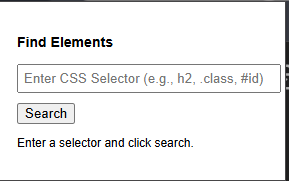
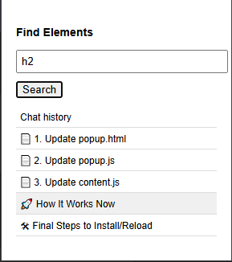

# Better-GPT-UX  

**Better-GPT-UX** was created to solve the frustration of navigating long web pages. Often, finding specific headings or elements requires endless scrolling.  

To fix this, I built a Chrome extension that lets users **search for any HTML element using a CSS selector** and **smoothly scroll to it instantly**.  

Now, with just a few clicks, you can quickly jump to the content you need, **improving browsing efficiency and user experience**. 🚀  

## 🔍 Search UI  

  

## 📌 Post-Search Navigation  

  
